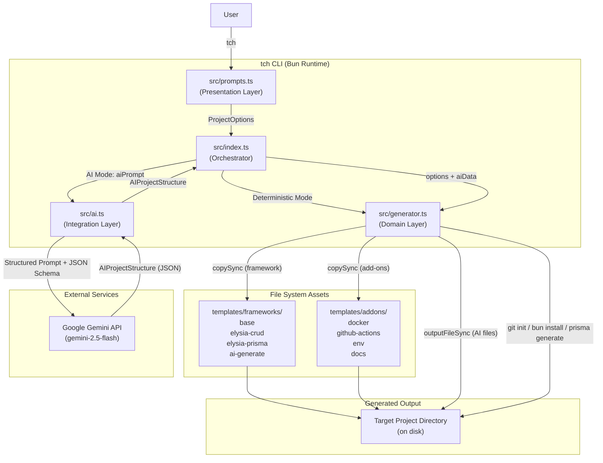
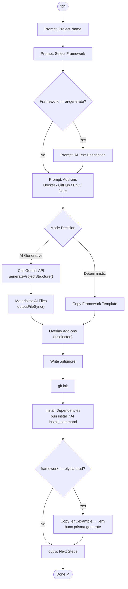
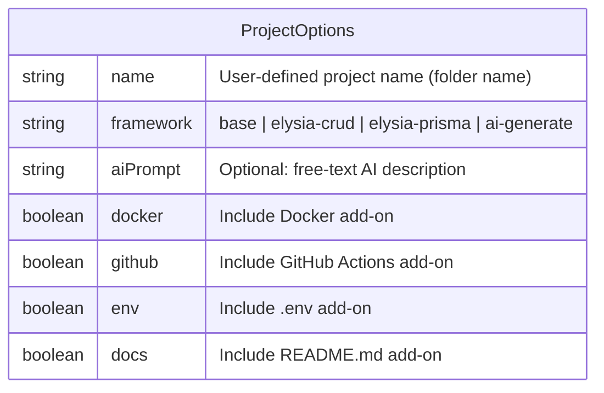
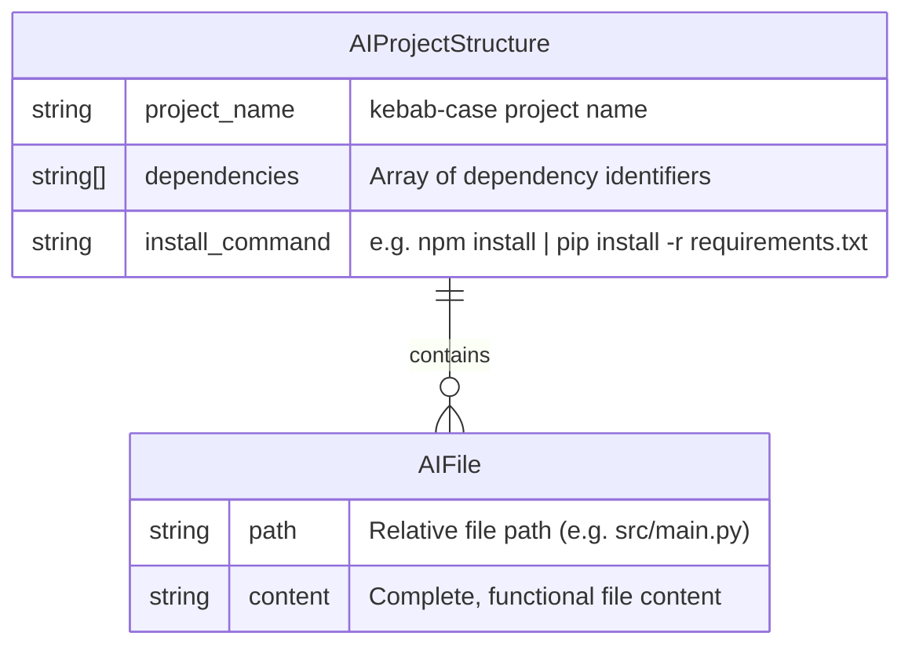
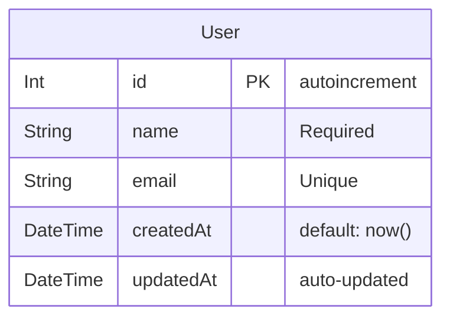
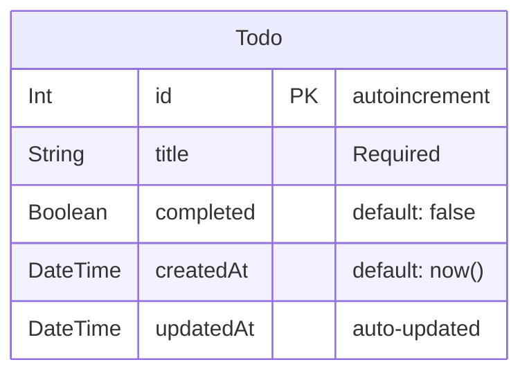
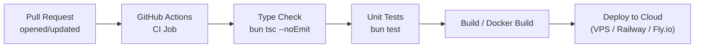

# `tch` — AI-Native Project Scaffolding CLI

> **A dual-mode project scaffolding tool powered by Bun and Google Gemini AI.**  
> Instantly bootstrap production-ready TypeScript / Elysia / Prisma projects — or let AI generate an entirely custom project structure from a plain-text description.

---

## Table of Contents

1. [Planning](#1-planning)
2. [Analysis](#2-analysis)
3. [Design](#3-design)
4. [Implementation](#4-implementation)
5. [Testing](#5-testing)
6. [Deployment](#6-deployment)
7. [Maintenance](#7-maintenance)

---

## 1. Planning

### 1.1 Problem Statement

Modern backend developers spend significant time configuring repetitive boilerplate: initialising a Git repository, wiring up an ORM, creating Docker files, and establishing GitHub Actions workflows. This friction slows down project inception and introduces inconsistency across teams.

`tch` (short for **TaiChi CLI**) solves this by providing a **single interactive command** that scaffolds a fully configured, production-ready project in seconds — or delegates the entire architecture design to a **Google Gemini AI agent** when the required technology is not covered by a predefined template.

### 1.2 Core Objectives

| # | Objective | Status |
|---|-----------|--------|
| 1 | Interactive CLI that guides the developer through project options | ✅ Implemented |
| 2 | Deterministic template-based scaffolding for known stacks | ✅ Implemented |
| 3 | AI-generative mode that produces any project structure from a text prompt | ✅ Implemented |
| 4 | Composable add-on system (Docker, GitHub Actions, `.env`, README) | ✅ Implemented |
| 5 | Automated post-scaffold actions (Git init, dependency install, Prisma generate) | ✅ Implemented |
| 6 | Graceful degradation — non-fatal warnings instead of hard failures where possible | ✅ Implemented |

### 1.3 Technology Stack Rationale

| Technology | Role | Rationale |
|---|---|---|
| **Bun** | Runtime & package manager | Native TypeScript execution without a compile step; `import.meta.dir` for reliable path resolution; `bun install` speed advantage |
| **TypeScript (strict)** | Primary language | Type-safe contracts between `ProjectOptions`, `AIProjectStructure`, and generator functions eliminate an entire class of runtime bugs |
| **@clack/prompts** | Interactive TUI | Provides polished, accessible terminal UI components (spinners, selects, confirms) with minimal configuration |
| **@google/generative-ai** | Gemini SDK | First-party SDK for the `gemini-2.5-flash` model; enables structured JSON output via `responseMimeType` |
| **fs-extra** | File system utilities | Extends Node `fs` with `copySync`, `outputFileSync`, and `readJsonSync` — critical for template overlay and file mutation |
| **Elysia** | Scaffolded app framework | Ultra-fast Bun-native web framework with built-in TypeBox schema validation; acts as the target runtime for generated projects |
| **Prisma** | ORM in generated projects | Type-safe database access layer; `prismabox` generator auto-derives Elysia/TypeBox schemas directly from the Prisma model |

---

## 2. Analysis

### 2.1 Functional Requirements

| ID | Requirement | Source |
|----|-------------|--------|
| FR-01 | The CLI MUST prompt the user for a project name before any scaffold action | `src/prompts.ts` |
| FR-02 | The CLI MUST present a list of available framework templates as a selectable menu | `src/prompts.ts` |
| FR-03 | When `ai-generate` is selected, the CLI MUST prompt for a free-text project description | `src/prompts.ts` |
| FR-04 | The CLI MUST allow the user to opt-in or opt-out of Docker, GitHub Actions, `.env`, and README add-ons | `src/prompts.ts` |
| FR-05 | In Deterministic Mode, the generator MUST copy the correct framework template and overlay selected add-ons | `src/generator.ts` |
| FR-06 | In Deterministic Mode, `package.json` name MUST be updated to match the user-provided project name | `src/generator.ts` |
| FR-07 | In Deterministic Mode, a `.gitignore` and Git repository MUST be initialised automatically | `src/generator.ts` |
| FR-08 | For the `elysia-crud` template, the generator MUST run `prisma generate` automatically | `src/generator.ts` |
| FR-09 | In AI Mode, the CLI MUST call the Gemini API with a structured system prompt that enforces JSON output | `src/ai.ts` |
| FR-10 | In AI Mode, the generator MUST materialise all files returned by the AI under the user-named directory | `src/generator.ts` |
| FR-11 | In AI Mode, the install command returned by the AI MUST be executed automatically with graceful failure handling | `src/generator.ts` |
| FR-12 | The CLI MUST exit cleanly if the user cancels at any prompt | `src/prompts.ts` |
| FR-13 | The CLI MUST prevent scaffolding into a directory that already exists | `src/generator.ts` |

### 2.2 Non-Functional Requirements

| ID | Requirement | Notes |
|----|-------------|-------|
| NFR-01 | **Performance** — Bun runtime for sub-second cold start | Enforced by `#!/usr/bin/env bun` shebang |
| NFR-02 | **Type Safety** — Strict TypeScript compilation | `strict: true`, `noUncheckedIndexedAccess: true`, `noImplicitOverride: true` in `tsconfig.json` |
| NFR-03 | **Reliability** — All template paths must be validated before copy | `fs.existsSync` guards in `generator.ts` |
| NFR-04 | **Security** — API key loaded from environment variable only; never hardcoded | `process.env.GEMINI_API_KEY` with early-exit guard |
| NFR-05 | **Consistency** — Template/add-on overlay order must be deterministic | Framework copied first, add-ons overlaid sequentially |
| NFR-06 | **Maintainability** — Framework-to-path mapping maintained in a single source of truth | `generator.ts` branching logic tied to `ProjectOptions.framework` values |

### 2.3 Key Stakeholders & User Roles

| Role | Description |
|------|-------------|
| **Backend Developer** | Primary user; wants a ready-to-code TypeScript or Elysia/Prisma project without manual setup |
| **AI-Assisted Developer** | Power user who describes any arbitrary stack in plain English and receives a working scaffold |
| **DevOps Engineer** | Consumes the Docker and GitHub Actions add-ons; expects well-formed `Dockerfile` and `deploy.yml` stubs |
| **Template Maintainer** | Internal contributor who owns `templates/frameworks/*` and `templates/addons/*`; must align template changes with `generator.ts` path logic |

---

## 3. Design

### 3.1 Architectural Style

The CLI follows a **Layered Monolith** architecture within a single package:

- **Presentation Layer** — `src/prompts.ts` (interactive TUI via `@clack/prompts`)
- **Application / Orchestration Layer** — `src/index.ts` (mode routing and flow control)
- **Domain Layer** — `src/generator.ts` (file system scaffolding logic)
- **Infrastructure / Integration Layer** — `src/ai.ts` (Google Gemini API client)
- **Asset Layer** — `templates/` (static framework templates + composable add-ons)

### 3.2 Design Patterns

| Pattern | Location | Description |
|---------|----------|-------------|
| **Template Method** (GoF Behavioural) | `src/generator.ts` | `generateProject` and `generateAiProject` share a common skeleton (create dir → copy files → add-ons → `.gitignore` → git init → install) but differ in the core copy step |
| **Strategy** (GoF Behavioural) | `src/index.ts` | The `main()` function selects between two strategies at runtime: Deterministic (`generateProject`) or Generative (`generateAiProject`) based on `options.framework` |
| **Factory Method** (GoF Creational) | `src/ai.ts` | `generateProjectStructure()` acts as a factory that produces an `AIProjectStructure` object from a raw text prompt |
| **Composite / Overlay** (Structural) | `templates/addons/` | Add-ons are independent composable units that are overlaid onto the base framework template, forming a composite project output |
| **Singleton** | `templates/…/src/lib/prisma.ts` | The generated Prisma client is exported as a module-level singleton to prevent connection pool exhaustion |

### 3.3 System Architecture Diagram



### 3.4 CLI Interaction Flow



### 3.5 Data Models

#### `ProjectOptions` — User Input Contract



#### `AIProjectStructure` — Gemini API Response Contract



#### `elysia-crud` Template — Prisma Data Model



#### `elysia-prisma` Template — Prisma Data Model



---

## 4. Implementation

### 4.1 Directory Structure

```
project-scaffolding-cli-tool/
├── src/                          # CLI source code
│   ├── index.ts                  # Entrypoint — orchestration & mode routing
│   ├── prompts.ts                # Interactive TUI — collects ProjectOptions
│   ├── generator.ts              # File system scaffolding — Deterministic & AI modes
│   ├── ai.ts                     # Google Gemini integration — AIProjectStructure factory
│   └── utils.ts                  # Shared utility helpers
│
├── templates/
│   ├── frameworks/               # Pre-built framework templates (source of truth)
│   │   ├── base/                 # Minimal TypeScript general-purpose template
│   │   ├── elysia-crud/          # Elysia + Prisma REST CRUD (User entity, PostgreSQL)
│   │   ├── elysia-prisma/        # Elysia + Prisma v7 + PrismaBox (Todo entity, pg adapter)
│   │   └── ai-generate/          # Placeholder directory for AI-generated projects
│   │
│   └── addons/                   # Composable add-ons (overlaid after framework copy)
│       ├── docker/               # Dockerfile + docker-compose.yml stubs
│       ├── github/               # .github/workflows/deploy.yml stub
│       ├── env/                  # .env stub
│       └── docs/                 # README.md stub
│
├── DIP/                          # Dependency Inversion Proof / Reference implementation
│   ├── main.py                   # Python AI vision test script
│   ├── Dockerfile                # Reference Dockerfile for Python projects
│   └── docker-compose.yml        # Reference Docker Compose configuration
│
├── ai-vision-test/               # Additional AI vision experimentation workspace
├── .github/
│   └── copilot-instructions.md   # AI pair-programming guidelines for this repo
├── package.json                  # Root CLI package ("create-cli", bin: "tch")
├── tsconfig.json                 # Strict TypeScript configuration
├── bun.lock                      # Bun lockfile
└── .env                          # GEMINI_API_KEY (not committed to VCS)
```

### 4.2 Core Modules

#### `src/prompts.ts` — Presentation Layer
Collects all user intent through a sequential `@clack/prompts` group. The `aiPrompt` field is conditionally rendered only when `framework === 'ai-generate'`, implementing a **short-circuit evaluation** pattern at the TUI level.

#### `src/index.ts` — Orchestration Layer
The `main()` function implements the **Strategy Pattern**: it reads `options.framework` and routes to either `generateProject()` (Deterministic) or the AI pipeline (`generateProjectStructure()` → `generateAiProject()`). The `outro` message is also mode-aware, displaying the AI-generated `install_command` when in generative mode.

#### `src/generator.ts` — Domain Layer
Contains two exported functions:
- **`generateProject(options)`** — Deterministic scaffold. Implements a 7-step pipeline: Core Copy → Add-on Overlay → `package.json` Mutation → `.gitignore` Write → Git Init → Bun Install → Smart Execution (Prisma-specific steps for `elysia-crud`).
- **`generateAiProject(options, aiData)`** — AI scaffold. Iterates over `aiData.files` using `fs.outputFileSync` to materialise deeply nested paths automatically, then overlays add-ons, inits Git, and executes the AI-provided `install_command` with **Graceful Degradation** on failure.

#### `src/ai.ts` — AI-Native Integration Layer (Agentic Component)
This is the **agentic core** of the system. Key design decisions:
- **`systemInstruction`** constrains the model's role to *Software Architect CLI* — it refuses to output prose and only emits a JSON structure matching `AIProjectStructure`.
- **`responseMimeType: "application/json"`** enforces structured output at the API level, preventing Markdown code-fence leakage.
- **`temperature: 0.2`** minimises entropy in the model's output, favouring precise, deterministic file content over creative variation.
- The `gemini-2.5-flash` model is used for its balance of speed, cost, and code generation accuracy.

### 4.3 Template Architecture (Framework Templates)

| Template | Stack | Key Features |
|----------|-------|--------------|
| `base` | TypeScript (ESNext) | Minimal `tsconfig.json`, bare `src/` directory |
| `elysia-crud` | Elysia + Prisma 5 + PostgreSQL | Full CRUD for `User` entity; `t.Object` schema validation; automatic Prisma Client generation |
| `elysia-prisma` | Elysia + Prisma 7 + PrismaBox + `@prisma/adapter-pg` | `Todo` CRUD with `PATCH /toggle`; `prismabox` auto-generates TypeBox validators from schema; Prisma Postgres Driver Adapter |

### 4.4 Add-on Overlay Mechanism

Add-ons are copied **after** the framework template. Because `fs.copySync` overwrites by default, the overlay order is intentional:

```
Framework Template → Docker → GitHub Actions → Env → Docs
```

This allows add-ons to intentionally override framework-level files (e.g., a more specific `.env.example`).

---

## 5. Testing

> **Current Status:** No automated test suite exists at the root level. The `.github/copilot-instructions.md` explicitly acknowledges this: *"There is no real automated test suite at the root. For generator changes, validate by checking copy paths carefully and, when practical, scaffolding a sample project in a temporary directory."*

### 5.1 Intended Testing Strategy \[In Progress\]

#### Unit Tests
- **Framework**: `bun:test` (native Bun test runner)
- **Targets**:
  - `src/ai.ts`: Mock the Gemini SDK and assert that `generateProjectStructure()` correctly parses valid and invalid JSON responses.
  - `src/generator.ts`: Mock `fs-extra` and `child_process.execSync`; assert correct copy paths per framework selection and add-on combination.
  - `src/prompts.ts`: Validate the `aiPrompt` conditional rendering logic.

#### Integration Tests
- Scaffold a sample project into a temporary directory (`os.tmpdir()`).
- Assert that all expected files exist and that `package.json` name matches the user-provided project name.
- Verify that `.gitignore` and the Git repository are initialised correctly.

#### End-to-End (E2E) Tests \[To be defined\]
- Simulate the full interactive CLI session using a stdin pipe or a CLI testing library (e.g., `execa`).
- Assert the final directory output against a snapshot of expected files.

---

## 6. Deployment

### 6.1 Local Development

```bash
# Install dependencies
bun install

# Run the CLI interactively
bun run src/index.ts

# Alternatively (compile + run via npm script)
bun run dev
```

**Prerequisites:**
- [Bun](https://bun.sh) >= 1.3.10
- `GEMINI_API_KEY` environment variable set in `.env` (required for AI mode only)

```bash
# .env
GEMINI_API_KEY="your-google-ai-studio-key"
```

### 6.2 Publishing as a Global CLI \[To be defined\]

The `package.json` defines a binary entry point:

```json
{
  "bin": {
    "tch": "src/index.ts"
  }
}
```

Future distribution options:
- **npm publish** — Publish to the npm registry; users install via `npm install -g tch` or use `npx tch`.
- **bun publish** — Native Bun package registry distribution.
- **GitHub Releases** — Distribute a compiled binary via `bun build --compile src/index.ts --outfile tch`.

### 6.3 CI/CD Pipeline \[In Progress\]

The `templates/addons/github/.github/workflows/deploy.yml` stub exists but contains no workflow definition. The intended pipeline for generated projects is:



### 6.4 Docker Support (Generated Projects)

The `templates/addons/docker/` add-on provides `Dockerfile` and `docker-compose.yml` stubs that are scaffolded into the target project when the user opts in during the CLI prompts. Template content is pending population (`[In Progress]`).

---

## 7. Maintenance

### 7.1 Extending Framework Templates

To add a new framework template:
1. Create a new directory under `templates/frameworks/<new-template-name>/`.
2. Add a new `{ value: '<new-template-name>', label: '...' }` entry to the `select` options in `src/prompts.ts`.
3. If the template requires post-scaffold commands, add a new branch in `generateProject()` in `src/generator.ts`.
4. If `package.json` exists in the template, ensure the `name` mutation step in `generator.ts` handles it correctly.

### 7.2 Extending Add-ons

Add-ons in `templates/addons/` are independent. To add a new add-on:
1. Create a new directory under `templates/addons/<addon-name>/`.
2. Add a new `confirm` prompt in `src/prompts.ts` and a corresponding field in the `ProjectOptions` interface.
3. Add the copy logic in both `generateProject()` and `generateAiProject()` in `src/generator.ts`.

### 7.3 Scalability Considerations

| Area | Current State | Future Enhancement |
|------|---------------|--------------------|
| **Template Registry** | File system–based (`templates/`) | Plugin registry with remote template resolution via URL/Git |
| **AI Model** | Hardcoded `gemini-2.5-flash` | Configurable model selection (GPT-4o, Claude, local Ollama) |
| **Language Support** | Primarily TypeScript/JavaScript | Template registry expanded with Python, Go, Rust starters |
| **Output Validation** | None (trust AI JSON output) | JSON Schema validation on `AIProjectStructure` before materialisation |
| **Telemetry** | None | Opt-in usage analytics to inform template prioritisation |

### 7.4 Known Limitations & Future Enhancements

- **`deploy.yml` stub is empty** — GitHub Actions workflow template needs to be populated with a real CI/CD pipeline for the generated Elysia/Bun stack.
- **`Dockerfile` stub is empty** — Docker template needs a functional multi-stage Bun image.
- **No AI output validation** — The `AIProjectStructure` JSON from Gemini is parsed without JSON Schema validation; malformed responses cause a hard exit.
- **No test suite** — The root project has no automated tests; this is the highest-priority maintenance gap.
- **Single binary target** — The CLI currently requires Bun to be installed globally; a compiled binary distribution would improve developer experience.

---

## Quick Start

```bash
# 1. Clone the repository
git clone https://github.com/TaiChi112/create-cli.git
cd create-cli

# 2. Install dependencies
bun install

# 3. Set up environment (required for AI mode)
echo 'GEMINI_API_KEY="your-key-here"' > .env

# 4. Run the CLI
bun run src/index.ts
```

**Example session:**

```
┌  System Initialized: Scalable CLI Builder
│
◆  What is your project name?
│  my-awesome-api
│
◆  Which framework would you like to use?
│  ● Elysia CRUD
│
◆  Include Docker?
│  Yes
│
◆  Include GitHub Actions?
│  Yes
│
└  Success! Project my-awesome-api is ready.
   Navigate to it using: cd my-awesome-api
```

---

## License

`[To be defined]`

---

*Generated by Antigravity AI — Comprehensive SDLC Analysis | Last updated: April 2026*
